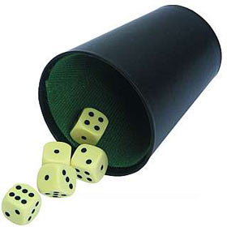

# Juego de dados

[![CC][1]][2]

[1]: images/cc.png
[2]: http://creativecommons.org/licenses/by-sa/3.0/

Ruben Cancho (2013 IES La Vereda)

---

# Contenidos

# Cosas que necesitaremos aprender para hacer el juego:

   * Variables -> almacenan objetos
   * Funciones -> contienen instrucciones
   * Eventos -> disparan funciones
   * Canvas -> permiten dibujar

# Presenter notes

canvas: dibujar lineas, incluir imagenes, poner texto de una forma mucho más libre que con HTML.
usado por la mayoría de juegos javascript.

programar: crear funciones (parecido a los grupos de bloques que recibian mensajes en scratch)
           tirar aleatoriamente un dado, funcion parecida a la de scratch.
       
---

# Reglas del juego: craps

1. Se tiran dos dados y se suman
    * GANAS: si sacas un 7 o 11 a la primera 
    * PIERDES: si sacas un 2, 3 o 12.
    * CONTINUAR: si sacas otra cosa.

2. Si continuas tiras otra vez
    * PIERDES: si sacas un 7
    * GANAS: si sacas lo mismo que en la ultima tirada
    * REPETIR: si sacas otra cosa

---

# Metodología de desarrollo

* Incremental
    * Añadimos funcionalidad poco a poco
    * Probamos cada cosa después de hacerla.
    * Organizamos el código para que quede más claro
 
* Iterativa
    * Versiones sucesivas que nos acercan al objetivo.
    * Cada version se construye sobre la anterior

--- 

# Iteracion 1

* ## Objetivo

## Mostrar un botón y al pulsar escribir el resultado de la tirada.

---

# Botones

## Como crear un botón

    !html
    <button>Tira los dados</button>

# Presenter notes

Mostrar chuleta HTML5
Hacer interfaz básica y esqueleto html

---

# Eventos

## *acciones* que suceden en un *objeto* y disparan una *funcion*

## Ejemplo

apretar un botón y que se muestre un mensaje.

* accion -> pulsar 
* objeto -> boton 
* funcion -> mostrar mensaje

# Presenter notes

* Ejemplos de acciones
    * apretar un botón
    * mover el ratón sobre un elemento
    * cargar una página

---

# Evento onclick

    !js
    function mostrar_mensaje() {
        window.alert("hola");
    }

    var boton;
    boton = document.getElementById("boton");
    boton.onclick = mostrar_mensaje;

# Presenter notes

Un evento está asociado a un objeto.
Las etiquetas son objetos.
Todas las etiquetas que se pueden clicar tienen el evento onclick.
Asociamos una funcion a un evento.

---

# Eventos y funciones

    !js
    function tirar_dados() {

    }    

    var boton;
    boton = document.getElementById("boton");
    boton.onclick = tirar_dados

# Presenter notes

    tirar_dados es una funcion definida por el usuario.
    El flujo del programa se empieza cuando se aprieta el botón, no cuando se carga la ventana (window.onload)

---

# PROBLEMA: Tirar dados

## Valor aleatorio entre 0 y 1

    !js
    Math.random()

---

# PROBLEMA: Tirar dados

## Redondea n hacia abajo

    !js
    Math.floor(n)

---

# PROBLEMA: Tirar dados

## Devuelve un valor entre 1 y 6

    !js
    1+Math.floor(Math.random()*6)

---

# Variables

* Guardan valores: números, texto, objetos, funciones,... 
* Se declaran usando *var*
* Se inicializan con el operador *=*

# Presenter notes

    Hacer ejemplos de asignacion de numero y texto.

----

# Variables

## Almacena la tirada en la variable "tirada":

    !js
    var tirada = 1+Math.floor(Math.random()*6);

---

# Funciones

* Que es una funcion?
    * *conjunto de instrucciones* que permiten resolver una tarea
    * Se puede llamar a la funcion desde otra parte del programa

---

# Funciones

* ## Para que sirven?
    * No "reinventar la rueda"
    * No repetir código
    * Más claridad y sencillez
    * Programas más fáciles de modificar

---

# Definicion de una funcion

    !js
    function nombreFuncion(parametro1, parametro2, ...) {
       var resultado; // variables locales

       ...
       return resultado; // retornar resultado
    }

#Presenter notes

    pueden tener parametros para realizar la tarea
    devuelven un resultado que puede guardarse en una variable
    podemos usar funciones dentro de funciones.

---

# Uso de una funcion

    !js
    var resultado;

    resultado = nombreFuncion(p1, p2);

---

# Tipos de funciones

* Funciones de la librería Javascript
    * Ejemplo: Date(), Math.random(), window.alert(msg)

* Funciones definidas por el usuario
    * function mifuncion() { ... }

# Presenter notes

    Podemos crear nuestrar propias funciones!

---

# Consejos prácticos sobre funciones

* Utilizarlas cuando repitas código
* Crear funciones que solo hagan una sola cosa
* Poner nombres claros a las funciones

---

# Práctica

* Tirar dos dados
* Imprimir el resultado en etiquetas
    * RECUERDA: getElementById()

---

# Práctica

* Reorganizar el código en funciones

# Presenter notes

Empezar con una gran funcion y ir refactorizando.

Resultado final despues de refactorizar

<pre>
   function tirada() {
       var tirada;
       tirada = 1+Math.floor(Math.random()*6);
       return tirada;
   }

   function imprimir_en(id, valor) {
       var etiqueta;
       etiqueta = document.getElementById(id);
       etiqueta.innerHTML = valor;
   }

   function tirar_dados() {
       imprimir_en("dado1", tirada());
       imprimir_en("dado2", tirada());
   }
</pre>

---

# Iteracion 2

* # Objetivo: Hacer el diseño más "cool"
    * Cambiar el fondo
    * Cambiar las fuentes
    * Añadir recuadro
    * Estilo del botón
    * ...

---

# Cheatsheet CSS

# http://overapi.com/css/

---

# Cambiar el fondo

* IMÁGENES EN GOOGLE:

    * "Free Stock Photos"

---

# Cambiar el fondo

* DIRECTIVAS CSS
    * background-image
    * background-repeat
    * background-position
    * background-attachment
    * background-size

---

# Cambiar el fondo
    !css
    html {
       background-image: url(images/dices.jpg);
       background-repeat: no-repeat;
       background-position: center center;
       background-attachment: fixed;
       background-size: cover;
    }

# Presenter notes

Ir explicando cada directiva una por una, viendo las opciones en el cheatsheet y haciendo el ejemplo a continuación.

---   

# Cambiar el fondo

    !css
    html {
       background: url(images/dices.jpg) no-repeat center center fixed cover;
    }

# Presenter notes

Como agrupar todas las directivas.

---

# Actividad

1. Busca una imagen de fondo para el juego.
2. Aplica directivas "background"
    * las mismas ó
    * Experimenta tú mismo

---

# Recuadro de juego

* DIRECTIVAS CSS
    * width
    * height
    * min-width
    * min-height

# Presenter notes

se puede aplicar a cualquier etiqueta
unidades en px, %, em

---

# Etiqueta div

* DIV
    * No da estilo
    * Sirve como Bloque de contenido
    * Finaliza con una nueva linea

# Presenter notes

Div se suele usar para cuadros de contenido. No da estilo.

---

# Ejemplo
    !css
    div {
        width: 50%;
        height: 50%;
        min-width: 200px;
        min-height: 200px;
    }

---

# Borde del recuadro

* DIRECTIVAS CSS
    * border-color
    * border-style
    * border-width
    * border-radius

---

# Ejemplo

    !css
    div {
        border-color: Black;
        border-style: solid;
        border-width: thick;
        border-radius: 10px;
    }

# Presenter notes

selector de color
http://www.quackit.com/css/css_color_codes.cfm

---

# Fondo semitransparente

* DIRECTIVA CSS:
    * background-color: rgba(R,G,B,A);

* RGBA:
    * R -> RED (ROJO)
    * G -> GREEN (VERDE)
    * B -> BLUE (AZUL)
    * A -> ALFA (TRANSPARENCIA)

---

# Fuentes

* Familias
    * Serif
    * Sans-Serif
    * Monospace
    * Cursive

# Presenter notes

Ver algunos tipos de fuentes y como ver las disponibles en el navegador.
Disponibilidad de fuentes: depende del navegador. 

---

# Fuentes

* CSS
    * @font-face -> definir nuevas fuentes
    * font-family -> familia o fuente de una regla
    * font-size -> tamaño de la fuente

# Presenter notes

Fuente que tiene caras de dados en vez de números
@font-face: Como utilizar una fuente en un archivo CSS
Como utilizar una fuente en una regla CSS

---

# Ejemplos fuentes "seguras"

    !css
    h1 {
        font-family: Arial, sans-serif;
    }

---

# Ejemplo fuentes importadas

    !css
    @font-face {
        font-family: "Dice";
        src: url(dice.ttf) format("truetype");
    }

    .dado {
        font-family: "Dice";
        font-size: 40px;
    }

---

# Tipos de archivos de fuentes

* Truetype (.ttf)
* Embedded OpenType (.eot)
* Web Open Font Format (.woff)

# Presenter notes

explicar parámetros directivas, hacer paso a paso
Descargarse fuentes de google fonts

---

# Actividad

1. Aplica el estilo de dados 
2. Cambia la fuente del título h1

---

# Ejemplo

# Botón más moderno

* <http://www.cssbuttongenerator.com/>

---

# Iteracion 3

Objetivo: hacer la lógica del juego

* Primer paso: GANAR SI SALE UN 7

* Pasos:
    * sumar los dados
    * si la suma es 7 entonces
       * mostrar el mensaje "HAS GANADO"
    * si no
       * continuar tirando

---

# Operadores de comparación

* Devuelven siempre true o false
    * x > y  (x mayor que y?)
    * x < y  (x menor que y?)
    * x >= y (x mayor o igual que y?)
    * x <= y (x menor o igual que y?)
    * x == y (x igual a y?)

# Presenter notes

que pueden ser x e y (variables, expresiones, constantes)
realizar ejemplos con la consola
devuelven verdadero o falso

---

# Condicionales: if

    !js
    if (condicion) {
       // condicion verdadera
    } 

---

# Condicionales: if (ejemplo)

    !js
    var tirada;

    tirada = 7;
    if (tirada == 7) {
        console.log("HAS GANADO!");
    }

# Presenter notes

hacer caso de ganar cuando se saca un 7
 
---

# Operadores booleanos

* Devuelven true o false

    * a && b -> a es verdad *Y* b es verdad?
    * x || y  -> a es verdad *O* b es verdad?
    * !x      -> a *NO* es verdad?

#Presenter notes

necesitamos saber cuando una tirada es igual a 7 O es igual a 11! Hacer ejemplo

---

# Operadores booleanos: ejemplo

    !js
    var tirada;

    tirada = 11;
    if ((tirada == 11) || (tirada == 7)) {
        console.log("HAS GANADO!");
    }

---

# Mostrar mensajes 

* Como mostramos los mensajes?
    * innerHTML

# Presenter notes

usar un div con id="mensaje".
usar imprime_en("mensaje", "HAS GANADO!");
añadir estilo CSS 

---

# Condicionales: if else

    !js
    if (condicion) {
        // condicion verdadera
    }
    else {
        // condicion falsa
    }
 
---

# Condicionales: if else

    !js
    var tirada;

    tirada = 7;
    if ((tirada == 7) || (tirada == 11)) {
        console.log("HAS GANADO!");
    }
    else {
        console.log("HAS PERDIDO!");
    }

---

# Condicionales: if else if 

   !js
    if (condicion1) {
        // condicion1 verdadera
    }
    else if (condicion2) {
        // condicion2 verdadera 
    } 
    else {
       // condicion1 y condicion2 falsas
    }
 
---

# Condicionales: if else if (ejemplo)

   !js
   var tirada;

   tirada = 7;
   if ((tirada == 7) || (tirada == 11)) {
       console.log("HAS GANADO!");
   }
   else if ((tirada == 2) || (tirada == 3) || (tirada == 12)) {
       console.log("HAS PERDIDO!");
   }
   else {
       console.log("CONTINUA JUGANDO!");
   }

---

# Que nos queda por hacer?

* Como saber si es la primera tirada?
* Como guardar la tirada anterior?
* Como mostrar los dados antiguos?
* Como mostrar mensajes?

---

# Como saber si es la primera tirada

    !js
    var es_primera_tirada;

    es_primera_tirada = true;
    if (es_primera_tirada) {
        // ENTRA AQUI
    }
    else {
        // NO ENTRA AQUI
    }

# Presenter notes

Modificar juego para que solo haga la logica en el primer caso.
Donde declarar es_primera_tirada? Variable global
Donde modificar es_primera_tirada? En tirar_dados()

---

# Como guardar tirada anterior

    !js
    var tirada_anterior

    if (es_primera_tirada) {
    ...
    }
    else {
       if (tirada == tirada_anterior) {
          console.log("HAS GANADO!");   
       }   
    // antes de acabar una tirada 
    tirada_anterior = tirada
    }

---

# Condicionales: switch

    !js
    switch (expression) {
        case valor1: // sentencias caso 1
            break;
        case valor2: // sentencias caso 2
            break;
        ...
        default: // sentencias resto de casos
    }

---

# Condicionales: switch (ejemplo)

    !js
    switch (tirada) {
        case 7: 
        case 11: 
            console.log("HAS GANADO!");
            break;
        case 2:
        case 3:
        case 12: 
            console.log("HAS PERDIDO!");
            break;
        default:
            console.log("CONTINUAS JUGANDO!");
    }    

# Presenter notes

Hacer caso de perder: 2, 3 o 12
---

# Canvas

* Nos permite dibujar libremente
* Mediante javascript

---

# Canvas

Etiqueta canvas:

    !html
    <canvas id="canvas" width="400" height="300">
       Tu navegador no soporta el elemento canvas
    </canvas>

---

# Canvas

Obtener el objeto canvas desde javascript:

    !js
    var canvas;
    canvas = document.getElementById("canvas").getContext("2d");

# Canvas

Dibujar un cuadrado:

    !js
    canvas.strokeRect(100,50,200,300);

# Canvas

Dibujar un cuadrado con color y estilo:

    !js
    canvas.lineWidth = 5;
    canvas.strokeStyle = "rgb(255,0,0)";
    canvas.strokeRect(100,50,200,300);

