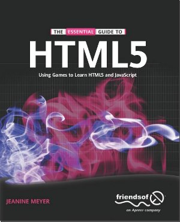

# Introducción a HTML5

Ruben Cancho (IES La Vereda 2013)

# Presenter notes

Hola, en este trimestre os voy a dar una introducción al desarrollo de páginas web con HTML5.

---

# Por qué?

  * La web es el presente (y el futuro)
  * Futuro laboral
  * Actividad creativa

# Presenter notes

Por qué es interesante saber hacer páginas web? 

La web es el presente y el futuro. Cada vez utilizamos más servicios online, como por ejemplo un sistema de reservas o una tienda online. Estamos hablando de páginas web más complicadas que hacer una página estática con el kompozer y que requieren de muchos conocimientos técnicos.

Por eso desarrollar webs es un buen futuro laboral. Cada vez se necesitan más programadores y diseñadores web en el mundo, cada vez funcionamos más a través de la red, y esa tendencia va a continuar durante mucho tiempo. 

Además, realizar páginas web es una trabajo muy creativo donde se mezclan conocimientos con arte, donde vas a poder trabajar con gente de todo el mundo y trabajar desde casa, si quieres. Además, la complejidad de las páginas web no tiene límites. Si te gusta aprender cosas nuevas haciendo páginas web nunca acabarás de aprender.

--- 

# Que aprenderemos?

* HTML5
* CSS
* Javascript

# Presenter notes

Que vamos a aprender? 
Vamos a ver los principales lenguajes necesarios para hacer páginas web: HTML, CSS y Javascript.

HTML es un lenguaje que sirve para estructurar el contenido de una web. El contenido puede ser el texto, las imágenes, los videos, etc... HTML organiza ese contenido y permite crear enlaces a otras páginas. HTML5 es la versión 5 del lenguaje, la que más funcionalidad tiene y la que más se utiliza actualmente.

El lenguaje CSS lo usaremos para que la página web se muestre con un estilo y formato determinado. CSS permite modificar la forma en que se visualizará el texto: las fuentes, tamaños de letra, colores,... pero también la situación de los párrafos y cambiar la forma de ver la página en diferentes dispositivos: movil, pc, etc...

Por ultimo el lenguaje Javascript nos permitirá crear páginas web dinámicas, es decir, páginas que interactuen con nosotros mediante el ratón o el teclado. Por ejemplo, Javascript nos permitirá crear efectos, juegos, o cargar información sin necesidad de refrescar toda la página. En definitiva, hacer aplicaciones web que se parezcan a aplicaciones de escritorio.

---

# Como vamos a aprender?

# Presenter notes

Como vamos a aprender? Pues seguiremos una metodología muy parecida a la del trimestre anterior: hacer juegos, pero esta vez funcionaran en una página web. Utilizaremos las herramientas y lenguajes que usan los profesionales para hacer los juegos online, y aprenderemos a subir nuestros juegos en la red para que esten accesibles para todo el mundo.

---

# Recursos 

* Videotutoriales
* Libro: "The essential guide to HTML5"

# Presenter notes

A lo largo del trimestre haremos prácticas guiadas mediante videotutoriales como este. Todas las prácticas estaran basadas en los proyectos del libro "La guia esencial a HTML5: usango juegos para aprender HTML5 y Javascript". Eso sí, el libro está en inglés, un idioma básico que hay que saber bien si quereis llegar lejos en la informática y en otros campos.

--- 

# PRÁCTICA 1: empezando con HTML5
# Objetivos

- Construir una página web que contenga enlaces.
- Usar un editor para hacer páginas web.
- Usar el navegador para comprobar la página web.

# Presenter notes

Y después de esta introducción vamos a empezar la primera práctica, en la que haremos nuestra primera página web. Consistirá en una sencilla página con algo de texto y enlaces. Para hacerla aprenderemos la estructura básica de un documento HTML, veremos como crear los documentos con un editor básico y como verificar que hemos hecho bien la página con el navegador. A partir de aquí realizareis conmigo los mismos pasos y los mismos ficheros.

---

# Ejemplo HTML

    !html
    <html>
      <head>
        <title>Ejemplo muy sencillo</title>
      </head>
      <body>
        Este texto aparecerá en la página tal cual.
      </body>
    </html>

# Presenter notes

Comentar etiquetas, utilizar notepad para hacer lo mismo, guardar en una carpeta "ejercicio1" y comprobar en el navegador.

---

# Ejemplo HTML (imágenes y enlaces)

    !html
    <html>
      <head>
        <title>Segundo ejemplo</title>
      </head>
      <body>
        Este texto aparecerá en la página tal cual.
        
        
        <a href="http://www.google.es">Google</a>
        
      </body>
    </html>

--- 

# Imagenes y enlaces

    !html
    <a href="http://...">TEXTO DEL ENLACE</a>

    

# Presenter notes
Repasemos las etiquetas de enlaces y imágenes. 

---

# Saltos de linea?

* *PROBLEMA*: HTML ignora saltos de linea

Solucion:

    !html
     

---

# Ejemplo HTML (con saltos de linea)

    !html
    <html>
      <head>
        <title>Segundo ejemplo</title>
      </head>
      <body>
        Este texto aparecerá en la página tal cual. 
        
         
        
         
        <a href="http://www.google.es">Google</a>
         
        
      </body>
    </html>

# Presenter notes

Modificar ejemplo anterior, probar con los retornos de carro y luego añadir br

---

# Etiquetas de título

    !html
    <h1>Titulo muy grande</h1>
    <h2>Titulo no tan grande</h2>
    <h3>Titulo más pequeño</h3>
    <h4>Titulo aun más pequeño</h4>
    <h5>Titulo más pequeño aún</h5>
    <h6>Titulo muy pequeño</h6>

---

# Ejemplo HTML (etiquetas de título)

    !html
    <html>
      <head>
        <title>Segundo ejemplo</title>
      </head>
      <body>
        <h1>Este es un título muy grande</h1>
        <h2>Este es un subtítulo</h2>
        Este texto aparecerá en la página tal cual. 
        
    ... 

---

# Etiquetas de párrafo

    !html
    
Aqui ponemos un párrafo

    
Esto es otro párrafo

---

# Ejemplo HTML (etiquetas de párrafo)

    !html
    <html>
      <head>
        <title>Segundo ejemplo</title>
      </head>
      <body>
        <h1>Este es un título muy grande</h1>
        <h2>Este es un subtítulo</h2>
        
Este es un párrafo. lorem ipsum lorem ipsum

        
Este es un párrafo. lorem ipsum lorem ipsum

        Este texto aparecerá en la página tal cual. 
        
 
---

# CSS

* dar estilo
* basado en reglas y directivas
* archivos extensión css

# Presenter notes

Reglas -> sirven para identificar que etiquetas se verán afectadas
Directivas -> Indican el estilo que se le aplicará.
Archivos anexos con extensión css que se referencian desde el archivo html

---

# Lenguaje CSS 

    !css
    regla { 
           directiva;
           directiva;
           directiva;
    }
   
    regla { 
           directiva;
           directiva;
           directiva;
    }
    ...

# Presenter notes

Explicar que es una regla css, y comentar las diferentes propiedades y valores. Dar una referencia para la lista de propiedades en la web (TODO: url)

---

# Ejemplo CSS

    !css
    body {
        background-color: tan;
        color: #EE015;
        text-align: center;
        font-size: 22px;
    }

# Presenter notes

Ejemplo sencillo de archivo de estilos con una sola regla y 4 directivas.

---

# HTML y CSS

    !html
    <html>
      <head>
        <link rel="stylesheet" href="estilo.css">
      </head>
      <body>
      ...
      </body>
    </html>

# Presenter notes

Explicar como se enlaza un archivo css y luego hacer ejemplo con el estilo anterior y el segundo ejemplo HTML.

---

# Directivas

   Chuleta de directivas:

   http://lesliefranke.com/files/reference/csscheatsheet.html

---

# Ejercicio CSS 

Añadir las siguientes directivas al "body" del ejercicio 2:

    !css
    body {
       background-color: tan;
       color: #EE015;
       text-align: center;
       font-size: 22px;
    }

---

# Javascript

* ## Lenguaje de programación
* ## Orientado a eventos
* ## Modificar HTML/CSS en tiempo real

# Presenter notes

Diferencia entre un lenguaje de programación y un lenguaje descriptivo
Ejemplos de posibles eventos: 

   de usuario -> hacer click en un elemento, escribir en un cuadro de texto, mover el raton,...
   de programa -> al pasar un determinado tiempo, al recibir un mensaje de otro objeto,...

Lista de ejemplos de posibles efectos:
   - dar mensajes de error cuando no hemos escrito los valores adecuados en un formulario.
   - cambiar los contenidos y estilo de los elementos de la página cuando se aprieta un botón.

---

# Ejemplo Javascript

* ## Consola Javascript => F12

# Presenter notes

    2+2
    "hola" + "k ase"   
    Date();
    document
    document.write("hola");
    document.write(Date());

Explicar el objeto document, la funcion write y la funcion Date. i
Se usan parentesis para poner los parámetros de una funcion, si no tiene se abre y se cierra.
Se usan puntos para indicar que es una funcion relativa a un objeto.
Se usa el punto y coma para indicar el final de una sentencia. 

Es importante seguir las reglas del lenguaje o no funcionará bien.

Utilizar la consola Javascript de Google Chrome y hacerlo en tiempo real.

---

# Javascript y HTML

    !html
    <html>
      ...
      
      </body>
    </html>

# Presenter notes

antes de cerrar el body, para que se cargue bien la página primero.

---
 
# Javascript y HTML

    !js

    // Esta funcion empieza cuando se ha cargado la página
    function init() {
       // AQUI PONEMOS NUESTRAS INSTRUCCIONES
       ...
    }

    window.onload = init;

# Presenter notes

Hacer ejemplo. Utilizar consola de Google Chrome y probar a hacer un fallo para ver como depurar!

---

# Ejercicio resumen

## Añadir la fecha al ejercicio2 con Javascript

    !js
    
    function init() {
       document.write(Date());
    }

    window.onload = init;

---

# Objeto document

write -> MACHACA TODO EL DOCUMENTO :(

* Solucion!

    MÉTODO getElementById

---

# Solucion: paso 1

Añadimos etiqueta con identificador:

    !html
    ...
    

    </body>
    </html>

---

# Solucion: paso 2

Modificamos la etiqueta con Javascript:

    !html
    fecha = document.getElementById("fecha");
    fecha.innerHTML = Date();
